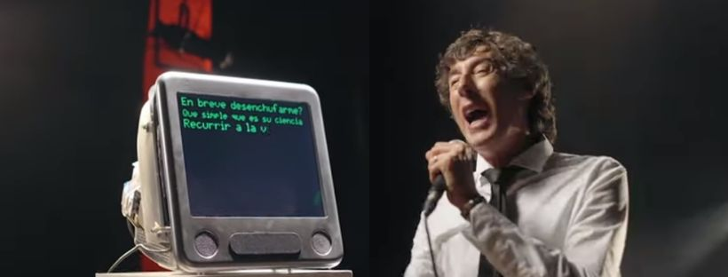

# LLM-RAP-BATTLE



## Installation
You can directly install the requirements.txt using an enviroment.

Or, you can use Docker to run this application. Docker makes it easy to create, deploy, and run applications by using containers. If you haven't installed Docker, please follow the instructions on the [official Docker website](https://docs.docker.com/get-docker/).

## Setup

### Step 1: Clone the repository

Clone the repository using the following command in your terminal:

```bash
git clone https://github.com/lucasikruger/llm-rap-battle
```


### Step 2: Build and run the Docker container

Navigate to the project's root directory in your terminal and run the following command to build and run the Docker container:

```bash
docker-compose up
```

This command will build the Docker image and run the container. The Streamlit server is exposed on port `8501` of your machine. 

You can access the application by opening a web browser and visiting `http://localhost:8501`.

## Usage

To use the application, follow these steps:

1. Select an llm 
2. Write rapper name, context and request.
3. The application will process your question, and give you a answer.


---

## Support

If you encounter any issues or have any questions about this application, please open a GitHub issue or submit a pull request.

## License

This project is open source and available under the [MIT License](LICENSE).
